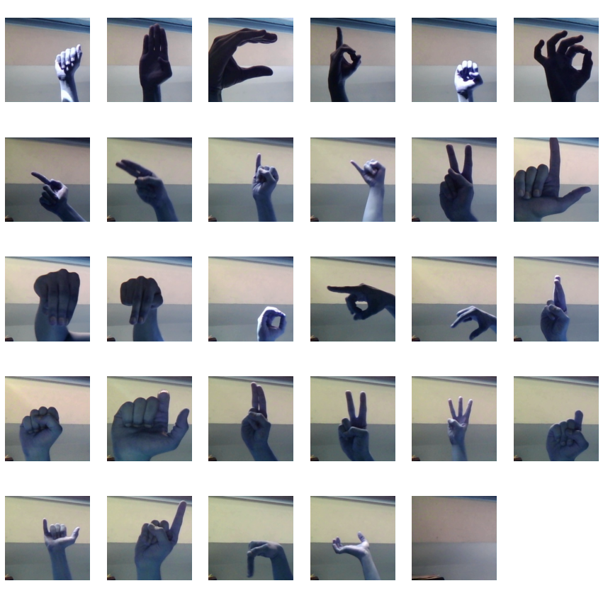

<!-- Declare hyper links to DataSet, Autors GitHub, and the project GitHub -->

[asl alphabet dataset]: https://www.kaggle.com/datasets/grassknoted/asl-alphabet
[denis]: https://github.com/Denloob
[itai]: https://github.com/ItaiAviad
[yoav]: https://github.com/EazyIf
["eazychat"]: https://eazychat.onrender.com/

# About the project

Unfortunately, not all people can hear or speak, and communication that is taking a very big part of our daily basis becomes a big problem.
Aslkeys is a project which will help you learn the sign language with your friends with the help of artificial intelligence and interactive chat ["EazyChat"].

#### Made by

[Denis], [Itai] and [Yoav] from Israel, The New Bosmat School

DM Den_loob#2209 using [discord](https://discord.com/) or using github to get in touch with the project.

##### Thanks to Akash for the [ASL Alphabet DataSet]

# Our Goals

As we mentioned before, we want to make a platform that will help you learn ASL with your friends to make the sign language more accessible for everyone. The AI is able to recognize the letter through your camera in live and will add the letter to the input field. After you finish typing your message, you can send it to your friends, who will read it and respond to you on the platform.

The more people will use our project, the more people that will be able to use the sign language on a daily basis, which will make the barrier of communication between people disappear.

<!-- image images/dataset_probe.png-->

